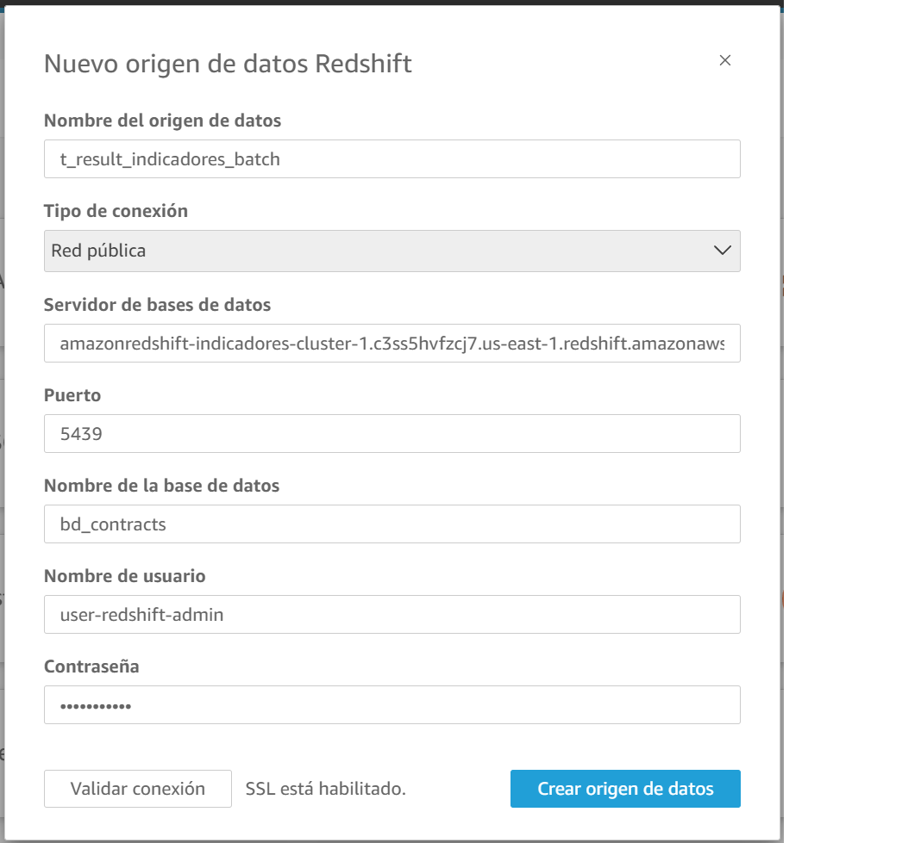

# Implementación de una arquitectura *Big Data* para el análisis de datos aplicado en la contratación pública en Colombia

<p align="center">
<b>Autores:<br></b>
Laura Milena Ramos Bermúdez y Juan Pablo Arevalo Merchán<br>
Candidatos a magíster en Informatica de la Escuela Colombiana de Ingeniería Julio Garavito<br>
Bogotá, Colombia<br>
laura.ramos-b@mail.escuelaing.edu.co<br>
juan.arevalo-m@mail.escuelaing.edu.co<br>
</p>


## Tabla de contenidos
1. [Arquitectura propuesta en AWS](#arquitectura-propuesta-en-aws)
2. [Instalación](#instalacion)
3. [Manual de uso](#manual-de-uso)
   1. [Para batch](#para-batch)
   2. [Para streaming](#para-streaming)
   3. [Visualización de datos](#visualizacion-de-datos)

## Arquitectura propuesta en AWS
<br><br>

## Instalacion
Para poder desplegar la arquitectura propuesta se desarrollaron los componentes requeridos con la siguiente estructura:
<br><br>
1. **aws-services:** Se encuentran las funciones requeridas para poder crear, configurar y desplegar los servicios requeridos.
2. **src:** Se encuentran los archivos requeridos para configurar variables generales de la arquitectura.
3. **main.py:** Main principal para la creación de la arquitectura propuesta.
4. **main_deleted.py:** Main principal para borrar los recursos y servicios de la arquitectura propuesta.
5. **producer_contracts.py:** Main para generar contratos demo para la arquitectura en tiempo real.

## Manual de uso

### Para batch

1. Instale AWS CLI en su máquina, para configurar las credenciales de uso de su cuenta principal, manual de instalación. [Para ver dar clic aquí.](https://docs.aws.amazon.com/cli/latest/userguide/getting-started-install.html) 

2. Compruebe la instalación AWS CLI.
   ```
    aws --version
   ```

3. Diríjase a su cuenta principal de AWS, luego busque en Servicios el servicio *'IAM'*, de clic en ***'Usuarios'*** y agrega un usuario en ***'Agregar usuarios'*** de la siguiente manera:

   1. ***Paso 1***: Escriba un ***'Nombre de usuario'*** nuevo.
   2. ***Paso 2***: Seleccione ***'Adjuntar políticas directamente'***, luego busque y seleccione ***'AdministratorAccess'***. Luego clic en ***'Siguiente'***.
   3. ***Paso 3***: Por último, revise la configuración y seleccione ***'Crear Usuario'***.
   4. Cuando lo haya creado seleccione el usuario y diríjase a ***'Credenciales de seguridad'***.
   5. Busque ***'Claves de acceso'*** y de clic en ***'Crear clave de acceso'***, luego de esto siga los pasos y descargue las credenciales.
   6. Luego abra la terminal de su computador y ejecute:
      ```
      aws configure
      ```
   
   7. Teniendo a mano el archivo de credenciales descargado, complete lo siguiente:
      ```
      AWS Access Key ID:
      AWS Secret Access Key:
      Default region name:
      ```
      
   8. Verifique las credenciales configuradas.
      ```
      aws configure list
      ```

4. Descargue y clone el repositorio del código fuente.
   ```
   git clone https://github.com/LauraMilenaRB/ref-arch-corruption-indicators.git
   ```

5. Configure las variables requeridas para la creación de los buckets, el servicio de apache airflow y las vpc.
   1. **Variables S3 Buckets**
      <br><br>
      1. **bucket_names:** Lista de los nombres de los buckets a crear, cambie el valor con el nombre que requiera.
      2. **bucket_dag_name:** Nombre del bucket que contiene el DAG del servicio Amazon MWAA.
      3. **prefix:** El prefix que se agregara a los nombres de los buckets para que sean unicos.
      4. **path_src_local_files:** Ruta local donde se encuentra la estructura de los buckets y archivos a subir.
         Esta estructura tiene el mismo nombre de los buckets a crear para así poder identificar los archivos que se deben subir a cada uno respectivamente.
         <br><br>
         * **aws-logs**:En este bucket se guardaran los logs de EMR.
         * **req-files/dags**: Contiene el código del flujo de datos del DAG. Un DAG es una colección de tareas organizadas que se programan y ejecutan de acuerdo a las necesidades del usuario.
         * **req-files/scripts**: Contiene los archivo del código fuente de los ETL ***(etl)*** y procesamientos de indicadores de corrupción ***(ind)***
   2. **Variables VPCs**
      <br><br>
      1. **vpc_name:** Nombre de la VPC a crear.
      2. **path_template_vpc_cloudformation:** Ruta local donde se encuentra el archivo template YAML de cloud formation para crear la VPC.
      3. **capabilities:** En algunos casos, debe reconocer explícitamente que su plantilla de pila contiene ciertas capacidades para que CloudFormation cree la pila. Mantenga este valor por defecto.
      4. **vpcCIDR:** El rango de IP para la VPC
      5. **publicsCIDR:** Las IPs de las subnets públicas de la VPC, para esta VPC se tienen 3 subnets públicas.
      6. **privatesCIDR:** Las IPs de las subnets privadas de la VPC, para esta VPC se tienen 3 subnets privadas.
   3. **Variables Amazon MWAA (Apache Airflow)**
      <br><br>
      1. **evn_mwaa_name:** Nombre del ambiente MWAA a crear.
   4. **Variables Amazon Kinesis**
      <br><br>
      1. ***kinesis_stream_name***: Nombre del stream kinesis.
      2. ***kinesis_delivery_stream_name***: Nombre de kinesis firehouse de kinesis.
      3. ***key_s3_bucket_staging_contracts***: El nombre de salida de la carpeta donde se guardaran los archivos.
      4. ***s3_output_staging_zone***: El nombre del bucket destino.
      5. ***column_partition_output_staging_zone***: Columnas de partición de la data si se requiere. Para nuestro de caso de uso no es requerido.
   5. **Variables stream Amazon EMR**
      <br><br>
      1. ***redshift_name_cluster***: Nombre del stream kinesis.
   6. **Variables Redshift**
      <br><br>
      1. ***redshift_name_cluster***: Nombre del cluster de redshift.
      2. ***name_bd***: Nombre de la base de datos de redshift.
      3. ***user_bd***: Nombre del usuario del cluster de redshift.
      4. ***password_bd***: Contraseña del usuario del cluster de redshift.
      5. ***DDL_result_batch***: Sentencia SQL del DDL de la tabla de resultados batch.
      6. ***DDL_result_stream***: Sentencia SQL del DDL de la tabla de resultados streaming.

6. Ejecute el Main principal y espere a que termine.
   1. Este script de python tiene las funciones de creación de S3 Buckets, Apache airflow, VPCs, Kinesis, Amazon EMR y Amazon Redshift.
      <br><br>
   2. Cuando lo ejecute verá en la terminal algo como esto: 
      <br><br>

7. Verifique la creación de los buckets, carpetas y carga de archivos correspondientes en la consola de servicios de Amazon S3, este proceso puede demorar un poco si se suben archivos locales.
   <br><br>
   <br><br>
8. Verifique la creación de la VPCs. Diríjase a CloudFormation en la consola de servicios de Amazon.
   <br><br>
9. Verifique la creación del cluster de Amazon Redshift, para esto diríjase en la consola de servicios y busque Amazon Redshift. Luego de esto debe ver el cluster ***'Available'***.
   <br><br>
   1. De clic en el cluster, luego en ***'Datos de consulta'*** > ***'Consulta en el editor de consultas v2'***
   <br><br>
   2. Verifiqué que las tablas de resultados que haya definido en el conf se hayan creado correctamente.
   <br><br>
10. Verifique la creación de Amazon MWAAA (Apache Airflow).
    1. Primero, verifique la creación de roles y políticas asociadas al servicio.
    <br><br>
    <br><br>
    2. Luego verifique que el entorno de Airflow este en creación. Tenga en cuenta que la creación de este servicio puede demorar entre 30 minutos a 1 hora aproximadamente.
    <br><br>
    3. **IMPORTANTE:** Debe configurar algunas variables requeridas antes de abrir la interfaz de usuario de Airflow.
       1. Para configurar el DAG, edité los siguientes archivos:
          <br><br>
          * **DAG-ContractingIndicators.py:** Contiene el código Python con el paso a paso de las tareas y servicios organizados para ejecutar. Tenga en cuenta que este puede remplazarse de acuerdo a las necesidades del caso de uso.
          * **vars_emr_jobs.py:** Contiene las variables requeridas para el DAG.
            1. **endpoint_url_arg**: Diccionario de las URLs para descargar los archivos del nuestro caso de uso, Contratación Pública.
               <br><br>
            2. **ind_sources**: Contiene los datos fuentes requeridos para poder empezar a procesar cada uno de los indicadores de corrupción.
               <br><br> 
            3. **JOB_FLOW_OVERRIDES:** Contiene toda la configuración para desplegar los clústeres de Spark para la ejecución de los ETLs y procesamientos.
               <br><br>
               * **LogUri:** Modifique esta variable con el nombre del bucket que guardara los Logs del clúster
               * **Ec2SubnetId:** Apenas despliegue la VPC verifique las subnets privadas desplegadas y remplace el valor existente por el Id de la subnet que tiene como descripción ***'vpc-mwaa - EMR - Private Subnet (AZ3)'***.
                 <br>**NOTA IMPORTANTE**: Esta variable debe configurarse correctamente para que el servicio Amazon EMR se despliegue correctamente. 
                 * Para ello busqué la consola de administración de las VPC y siga los pasos de las imágenes a continuación:
                   <br><br>
                   <br><br>
               * **StepConcurrencyLevel:** Esta variable determina cuantos steps concurrentes se pueden ejecutar en el clúster de EMR.
               * En este apartado hay muchas más variables que puede modificar, pero en este caso la configuración presentada es lo mínimo requerido para aprovisionar el servicio de EMR. 
                 <br>[Para más detalle dar clic aquí.](https://boto3.amazonaws.com/v1/documentation/api/latest/reference/services/emr/client/run_job_flow.html)
            4. <br><br>
               * **endpoint_conn_arg:** El host para conectarse a la base de datos de Amazon Redshift. Para ello busque el servicio Amazon Redshift, seleccione el cluster y en ***'Información general'*** copie el ***'Punto de enlace'*** como se muestra en la imagen: 
                 <br><br>
               * **bd_name_arg:** El nombre de la base de datos de Amazon Redshift para crear la tabla a consultar por quicksight.
               * **user_db_arg:** El usuario de la base de datos de Amazon Redshift.
               * **psw_db_arg:** La contraseña de la base de datos de Amazon Redshift.
               * **deleted_data_results:** La consulta para borrar los datos cargados en Amazon Redshift.
               * **insert_data_results:** La consulta para insertar datos en Amazon Redshift.
               
       2. Luego de editar las variables requeridas diríjase al Bucket S3 donde se almacena el archivo DAG.py y renplacelo por la nueva configuración.
       <br><br>
    4. Cuando se habilite el entorno y modifique las variables, puede dar clic en ***'Abrir la interfaz de usuario de Airflow'***.
       * Si el DAG contiene algún error, verá algo como esto: 
       * Si el DAG no contiene ningún error, verá algo como esto: 
    5. Al dar clic en el DAG puede observar el detalle del flujo de datos. 
    6. Para iniciar el flujo debe dar clic en el botón ***'Play'*** solo si ***'Next Run'*** está configurado con una fecha futura, en dado caso que esté configurado con una fecha anterior a la actual solo debe habilitar el interruptor *'Pause/Unpause DAG'* que aparece en la esquina superior izquierda.
       <br><br>
    7. Verifique el estado del flujo en la opción de ***'Graph'***. Verá algo como esto:
       <br><br>
    8. Cuando el DAG se inicia el flujo de datos cambia de color de acuerdo a las convenciones definidas.
       <br><br>
       1. Si en el flujo se presenta alguna falla, puede verificar el log dando clic sobre la tarea ***'failed'*** y luego dar clic en ***'Log'***
       <br><br>
       <br><br>
       2. También puede verificar los procesos batch en ejecución de spark buscando en la consola de servicios Amazon EMR.
       <br><br> <br><br>
       Aquí debe verificar que todos los steps queden en estado ***'Completado'***, en caso de que alguno falle puede validar el log correspondiente
    9. Una de las ventajas de Airflow es que podemos personalizar la programación de los DAG en un horario definido y para nuestro caso de uso programamos el DAG a ejecutarse una vez por semana, cada domingo. 
      A continuación puede ver en calendario configurado:
      <br><br>
    10. Espere a que se complete todo el flujo de datos y verifique la creación de la tabla de resultados en Redshift.
      <br><br>

### Para streaming

Luego de verificar el despliegue de la arquitectura batch puede verificar el despliegue de la arquitectura para el flujo de datos en tiempo real.
1. Vaya a la consola de servicios y busqué kinesis.
   1. Luego verifique que se haya creado kinesis data stream.
      <br><br>
   2. Verifique que se haya creado kinesis firehose.
      <br><br>

2. Verifique que se haya creado correctamente el clúster del servicio Amazon EMR y que se estén ejecutando los steps *'stream_etl'* y *'stream_ind'*. 
    <br><br>
   **Nota:** En este caso solo hay dos steps los cuales se ejecutaran indefinidamente, ya que deben estar disponibles lo mismo que dure el consumidor enviando contratos para ser procesados.

3. Para hacer uso de este flujo es necesario tener un productor el cual se encargara de enviar los datos a procesar, para nuestro caso de uso se desarrolló el consumidor *'producer_contracts'*.
   Este se encarga de generar contratos de manera automática y enviarlos a kinesis data stream cada 15 segundos aproximadamente. Ejecútelo cuando haya verificado que los steps se estén ejecutando.
   <br><br>

### Visualizacion de datos

1. Para validar los resultados y graficarlos vamos a la consola de Amazon QuickSight.
    1. Seleccione y de clic en ***'Conjunto de datos'*** > ***'Nuevo conjunto de datos'***.
       <br><br>
    2. Luego busque la opción ***'Redshift' (Detección automática)***, agregue los datos solicitados y haga clic en ***'Crear origen de datos'***.
       <br><br>
    3. Ya con este paso realizado podemos realizar la creación de las gráficas requeridas para visualizar y entender de una manera grafica el comportamiento de los datos.
       <br><br>
    4. Aquí puede configurar y usar otras herramientas de BI como Power BI, Tableau o Microstrategy utilizando los valores típicos de conexión a una base de datos. El host, nombre de la base de datos, usuario y contraseña.
       <br><br>

### Eliminacion de recursos y servicios en AWS
1. Luego de utilizar la arquitectura es necesario limpiar nuestro espacio de trabajo para ahorrar costos, para la eliminación de politicas, roles, servicios y recursos de la arquitectura debe ejecutar el main_deleted.
   <br><br>
2. Verifique todos los servicios, roles y políticas utilizadas y cerciórese de que están eliminados.
